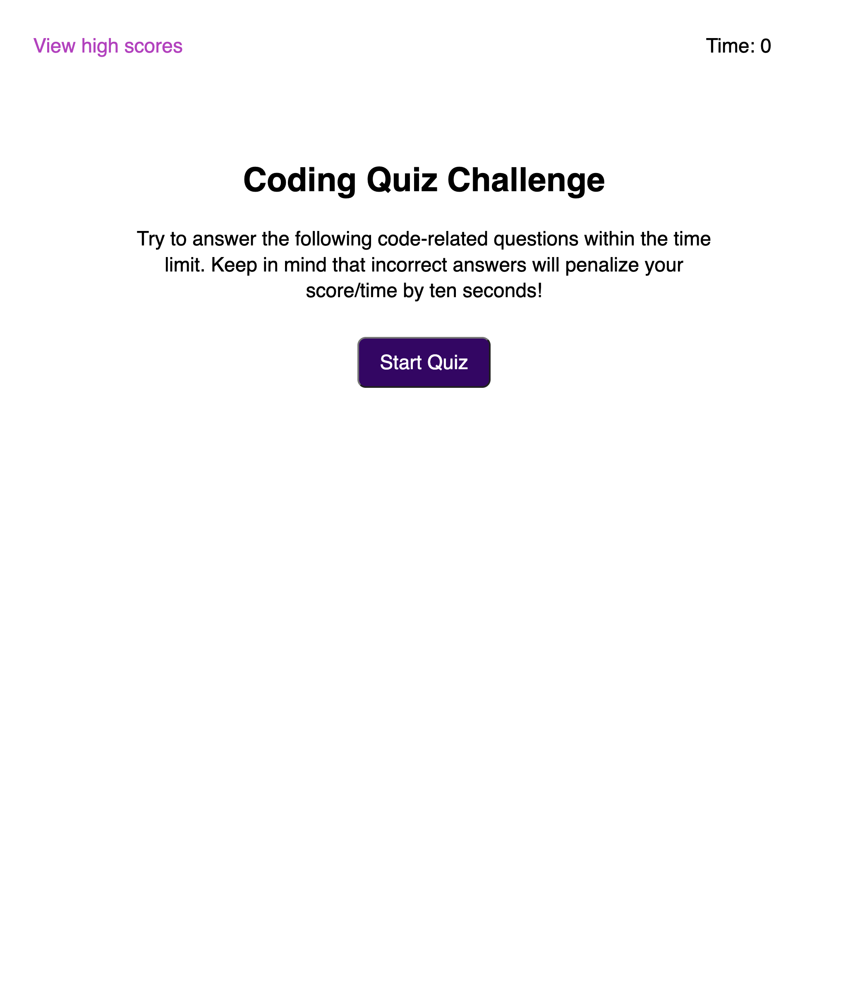

# JavaScript Coding Quiz

## Description

This webpage provides a quiz based on the JavaScript computing language. It will test the user on a series of topics, then provide a screen to enter the user's name. The user's name and score will then be stored in Local Storage to show maintain a high score leaderboard.

## Usage

Clicking on the 'Start Quiz' button will initiate the quiz and show the first question, along with starting a 75 second timer that will subtract 10 seconds for every incorrect answer. A score will be calculated according to the results of each question, and it will be presented at the end of the quiz, or when the timer runs out.

After the quiz is finished, the user will be presented with a place to put their name and submit their score. There will then be a leaderboard displayed with currently stored high scores in Local Storage and will give options to go back to the intro screen and also clear all high scores that are stored.

On the intro screen, there is also a 'View high scores' link at the top left of the page which will show the leaderboard of high scores.

## Screenshot

## Link

[https://jaredbartos.github.io/code-quiz](https://jaredbartos.github.io/code-quiz)